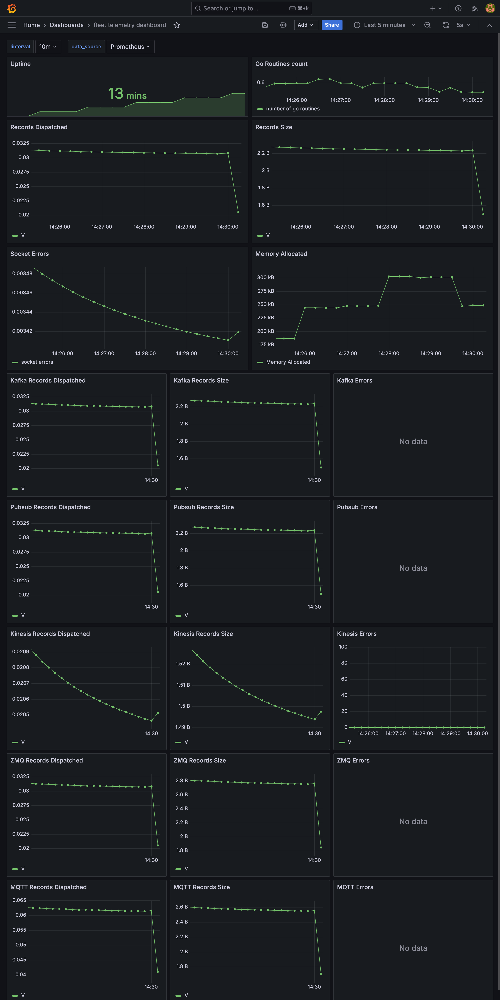

[](https://github.com/teslamotors/fleet-telemetry/actions/workflows/build.yml)
[](https://github.com/teslamotors/fleet-telemetry/tags)
[](https://hub.docker.com/r/tesla/fleet-telemetry/tags)

# Tesla Fleet Telemetry
---------------------------------

Fleet Telemetry is a server reference implementation for Tesla's telemetry protocol. Owners can allow registered applications to receive telemetry securely and directly from their vehicles. This reference implementation can be used by individual owners as is or by fleet operators who can extend it to aggregate data accross their fleet.

The service handles device connectivity as well as receiving and storing transmitted data. Once configured, devices establish a WebSocket connection to push configurable telemetry records. Fleet Telemetry provides clients with ack, error, or rate limit responses.

## Configuring and running the service

### Setup steps

1. Create a developer application via [developer.tesla.com](https://developer.tesla.com).
   - In the "Client Details" step, it is recommended to select "Authorization Code and Machine-to-Machine" for most use cases. "Machine-to-Machine" (M2M) should only be selected for business accounts that own vehicles.
2. Generate an EC private key using the secp256r1 curve (prime256v1).
   - `openssl ecparam -name prime256v1 -genkey -noout -out private-key.pem`
3. Derive its public key.
   - `openssl ec -in private-key.pem -pubout -out public-key.pem`
4. Host this public key at: `https://*application-domain.com*/.well-known/appspecific/com.tesla.3p.public-key.pem`.
5. Generate a Partner Authentication Token. ([docs](https://developer.tesla.com/docs/fleet-api/authentication/partner-tokens))
6. Register the application with Fleet API via the [register](https://developer.tesla.com/docs/fleet-api/endpoints/partner-endpoints#register) endpoint.
7. Configure a fleet-telemetry server. Full details are described in [install steps](#install-steps).
8. Validate the server configuration using [check_server_cert.sh](https://github.com/teslamotors/fleet-telemetry/blob/main/tools/check_server_cert.sh).
    - From a local computer, create `validate_server.json` with the following fields:
      - `hostname`: The hostname the fleet-telemetry server.
      - `port`: The port the fleet-telemetry server -- Default 443.
      - `ca`: The full certificate chain used to generate the server's TLS certificate.
    - Run `./check_server_cert.sh validate_server.json`
9. Ensure the application's virtual key has been added to the vehicle(s). See documentation here: https://developer.tesla.com/docs/fleet-api/endpoints/vehicle-commands#key-pairing.
10. Configure and run the [vehicle-command proxy](https://github.com/teslamotors/vehicle-command#installation-and-configuration) with the application private key.
11. Configure vehicle(s) with the [fleet_telemetry_config](https://developer.tesla.com/docs/fleet-api/endpoints/vehicle-endpoints#fleet-telemetry-config-create) endpoint.
12. Wait for `synced` to be true when getting [fleet_telemetry_config](https://developer.tesla.com/docs/fleet-api/endpoints/vehicle-endpoints#fleet-telemetry-config-get).
13. Vehicles will connect and stream data directly to the hosted fleet-telemetry server. To diagnose connection or streaming problems use the [fleet_telemetry_errors](https://developer.tesla.com/docs/fleet-api/endpoints/partner-endpoints#fleet-telemetry-errors) endpoint.

### Install on Kubernetes with Helm Chart (recommended)
For ease of installation and operation, run Fleet Telemetry on Kubernetes or a similar environment. Helm Charts help define, install, and upgrade applications on Kubernetes. A reference helm chart is available [here](https://github.com/teslamotors/helm-charts/blob/main/charts/fleet-telemetry/README.md).

### Install steps
1. Allocate and assign a [FQDN](https://en.wikipedia.org/wiki/Fully_qualified_domain_name). This will be used in the server and client (vehicle) configuration.

2. Design a simple hosting architecture. We recommend: Firewall/Loadbalancer -> Fleet Telemetry -> Kafka.

3. Ensure mTLS connections are terminated on the Fleet Telemetry service.

4. Configure the server (Helm charts cover some of this configuration)
```
{
  "host": string - hostname,
  "port": int - port,
  "log_level": string - trace, debug, info, warn, error,
  "json_log_enable": bool,
  "namespace": string - kafka topic prefix,
  "reliable_ack": bool - for use with reliable datastores, recommend setting to true with kafka,
  "monitoring": {
    "prometheus_metrics_port": int,
    "profiler_port": int,
    "profiling_path": string - out path,
    "statsd": { if not using prometheus
      "host": string - host:port of the statsd server,
      "prefix": string - prefix for statsd metrics,
      "sample_rate": int - 0 to 100 percentage to sample stats,
      "flush_period": int - ms flush period
    }
  },
  "logger": {
    "verbose": bool - include data types in the logs. Only applicable for records of type 'V'
  },
  "kafka": { // librdkafka kafka config, seen here: https://raw.githubusercontent.com/confluentinc/librdkafka/master/CONFIGURATION.md
    "bootstrap.servers": "kafka:9092",
    "queue.buffering.max.messages": 1000000
  },
  "kinesis": {
    "max_retries": 3,
    "streams": {
      "V": "custom_stream_name"
    }
  },
  "rate_limit": {
    "enabled": bool,
    "message_limit": int - ex.: 1000
  },
  "records": { // list of records and their dispatchers, currently: alerts, errors, and V(vehicle data)
    "alerts": [
        "logger"
    ],
    "errors": [
        "logger"
    ],
    "V": [
        "kinesis",
        "kafka"
    ]
  },
  "tls": {
    "server_cert": string - server cert location,
    "server_key": string - server key location
  }
}
```
Example: [server_config.json](./examples/server_config.json)

5. (Manual install only) Deploy and run the server. Get the latest docker image information from our [docker hub](https://hub.docker.com/r/tesla/fleet-telemetry/tags). This can be run as a binary via `./fleet-telemetry -config=/etc/fleet-telemetry/config.json` directly on a server, or as a Kubernetes deployment. Example snippet:
```yaml
---
apiVersion: apps/v1
kind: Deployment
metadata:
  name: fleet-telemetry
spec:
  replicas: 1
  selector:
    matchLabels:
      app: fleet-telemetry
  template:
    metadata:
      labels:
        app: fleet-telemetry
    spec:
      containers:
      - name: fleet-telemetry
        image: tesla/fleet-telemetry:<tag>
        command: ["/fleet-telemetry", "-config=/etc/fleet-telemetry/config.json"]
        ports:
        - containerPort: 443
---
apiVersion: v1
kind: Service
metadata:
  name: fleet-telemetry
spec:
  selector:
    app: fleet-telemetry
  ports:
    - protocol: TCP
      port: 443
      targetPort: 443
  type: LoadBalancer
```


## Vehicle Compatibility

Vehicles must be running firmware version 2023.20.6 or later.  Some older model S/X are not supported.

## Backends/dispatchers
The following [dispatchers](./telemetry/producer.go#L10-L19) are supported
* Kafka (preferred): Configure with the config.json file.  See implementation here: [config/config.go](./config/config.go)
  * Topics will need to be created for \*prefix\*`_V`, \*prefix\*`_alerts`, and \*prefix\*`_errors`. The default prefix is `tesla`
* Kinesis: Configure with standard [AWS env variables and config files](https://docs.aws.amazon.com/cli/latest/userguide/cli-configure-envvars.html). The default AWS credentials and config files are: `~/.aws/credentials` and `~/.aws/config`.
  * By default, stream names will be \*configured namespace\*_\*topic_name\*  ex.: `tesla_V`, `tesla_errors`, `tesla_alerts`, etc
  * Configure stream names directly by setting the streams config `"kinesis": { "streams": { *topic_name*: stream_name } }`
  * Override stream names with env variables: KINESIS_STREAM_\*uppercase topic\* ex.: `KINESIS_STREAM_V`
* Google pubsub: Along with the required pubsub config (See ./test/integration/config.json for example), be sure to set the environment variable `GOOGLE_APPLICATION_CREDENTIALS`
* ZMQ: Configure with the config.json file.  See implementation here: [config/config.go](./config/config.go)
* Logger: This is a simple STDOUT logger that serializes the protos to json.
  
>NOTE: To add a new dispatcher, please provide integration tests and updated documentation. To serialize dispatcher data as json instead of protobufs, add a config `transmit_decoded_records` and set value to `true` as shown [here](config/test_configs_test.go#L186)

## Reliable Acks
Fleet telemetry can send ack messages back to the vehicle. This is useful for applications that need to ensure the data was received and processed. To enable this feature, set `reliable_ack_sources` to one of configured dispatchers (`kafka`,`kinesis`,`pubsub`,`zmq`) in the config file. Reliable acks can only be set to one dispatcher per recordType. See [here](./test/integration/config.json#L8) for sample config.

## Metrics
Configure and use Prometheus or a StatsD-interface supporting data store for metrics. The integration test runs fleet telemetry with [grafana](https://grafana.com/docs/grafana/latest/datasources/google-cloud-monitoring/), which is compatible with prometheus. It also has an example dashboard which tracks important metrics related to the hosted server. Sample screenshot for the [sample dashboard](./test/integration/grafana/provisioning/dashboards/dashboard.json):-



## Logging

To suppress [tls handshake error logging](https://cs.opensource.google/go/go/+/master:src/net/http/server.go;l=1933?q=%22TLS%20handshake%20error%20from%20%22&ss=go%2Fgo), set environment variable `SUPPRESS_TLS_HANDSHAKE_ERROR_LOGGING` to `true`. See [docker compose](./docker-compose.yml) for example.

## Protos
Data is encapsulated into protobuf messages of different types. Protos can be recompiled via:

  1. Install protoc, currently on version 4.25.1: https://grpc.io/docs/protoc-installation/
  2. Install protoc-gen-go: `go install google.golang.org/protobuf/cmd/protoc-gen-go@v1.28`
  3. Run make command
  ```sh
  make generate-protos
  ```
## Airbrake
Fleet telemetry can publish errors to [airbrake](https://www.airbrake.io/error-monitoring). The integration test runs fleet telemetry with [errbit](https://github.com/errbit/errbit), which is an airbrake compliant self-hosted error catcher. A project key can be set for airbrake using either the config file or via an environment variable `AIRBRAKE_PROJECT_KEY`. 

# Testing

## Unit Tests
To run the unit tests: `make test`

Common Errors:

```
~/fleet-telemetry➜ git:(main) ✗  make test
go build github.com/confluentinc/confluent-kafka-go/v2/kafka:
# pkg-config --cflags  -- rdkafka
Package rdkafka was not found in the pkg-config search path.
Perhaps you should add the directory containing `rdkafka.pc'
to the PKG_CONFIG_PATH environment variable
No package 'rdkafka' found
pkg-config: exit status 1
make: *** [install] Error 1
```
librdkafka is missing, on macOS install it via `brew install librdkafka pkg-config` or follow instructions here https://github.com/confluentinc/confluent-kafka-go#getting-started

```
~/fleet-telemetry➜ git:(main) ✗  make test
go build github.com/confluentinc/confluent-kafka-go/v2/kafka:
# pkg-config --cflags  -- rdkafka
Package libcrypto was not found in the pkg-config search path.
Perhaps you should add the directory containing `libcrypto.pc'
to the PKG_CONFIG_PATH environment variable
Package 'libcrypto', required by 'rdkafka', not found
pkg-config: exit status 1
make: *** [install] Error 1

~/fleet-telemetry➜ git:(main) ✗  locate libcrypto.pc
/opt/homebrew/Cellar/openssl@3/3.0.8/lib/pkgconfig/libcrypto.pc

~/fleet-telemetry➜ git:(main) ✗  export PKG_CONFIG_PATH=$PKG_CONFIG_PATH:/opt/homebrew/Cellar/openssl@3/3.0.8/lib/pkgconfig/
```
A reference to libcrypto is not set properly. To resolve find the reference to libcrypto by pkgconfig and set et the PKG_CONFIG_PATH accordingly.

libzmq is missing. Install with:
```sh
sudo apt install -y libsodium-dev libzmq3-dev
```
Or for macOS:
```sh
brew install libsodium zmq
```

## Integration Tests

To run the integration tests: `make integration`
To log into errbit instances, default username is `noreply@example.org` and default password is `test123`

## Building the binary for Linux from Mac ARM64

```sh
DOCKER_BUILD_KIT=1 DOCKER_CLI_EXPERIMENTAL=enabled docker buildx version
docker buildx create --name go-builder --driver docker-container --driver-opt network=host --buildkitd-flags '--allow-insecure-entitlement network.host' --use
docker buildx inspect --bootstrap
docker buildx build --no-cache --progress=plain --platform linux/amd64 -t <name:tag>(e.x.: fleet-telemetry:local.1.1) -f Dockerfile . --load
container_id=$(docker create fleet-telemetry:local.1.1) docker cp $container_id:/fleet-telemetry /tmp/fleet-telemetry
```

## Security and Privacy considerations

System administrators should apply standard best practices, which are beyond
the scope of this README.

Moreover, the following application-specific considerations apply:

* Vehicles authenticate to the telemetry server with TLS client certificates
  and use a variety of security measures designed to prevent unauthorized
  access to the corresponding private key. However, as a defense-in-depth
  precaution, backend services should anticipate the possibility that a
  vehicle's TLS private key may be compromised. Therefore:
  * Backend systems should sanitize data before using it.
  * Users should consider threats from actors that may be incentivized to
    submit falsified data.
  * Users should filter by vehicle identification number (VIN) using an
    allowlist if possible.
* Configuration-signing private keys should be kept offline.
* Configuration-signing private keys should be kept in an HSM.
* If telemetry data is compromised, threat actors may be able to make
  inferences about driver behavior even if explicit location data is not
  collected. Security policies should be set accordingly.
* Tesla strongly encourages providers to only collect data they need, limited to
  the frequency they need.
* Providers agree to take full responsibility for privacy risks, as soon as data
  leave the devices (for more info read our privacy policies).
